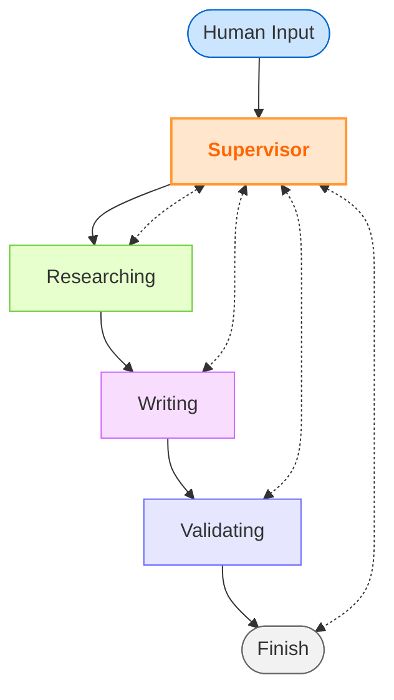
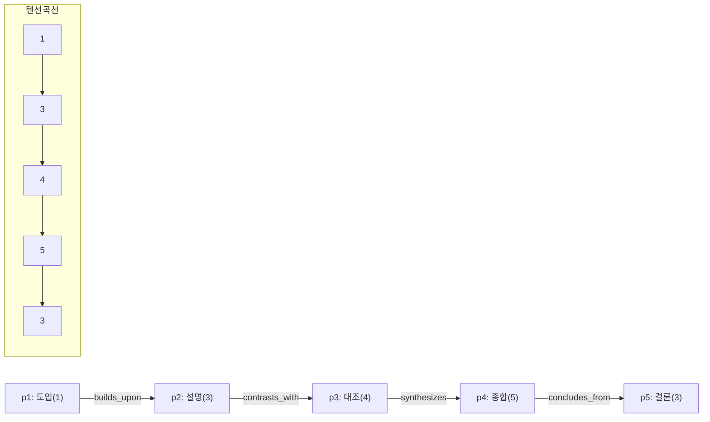
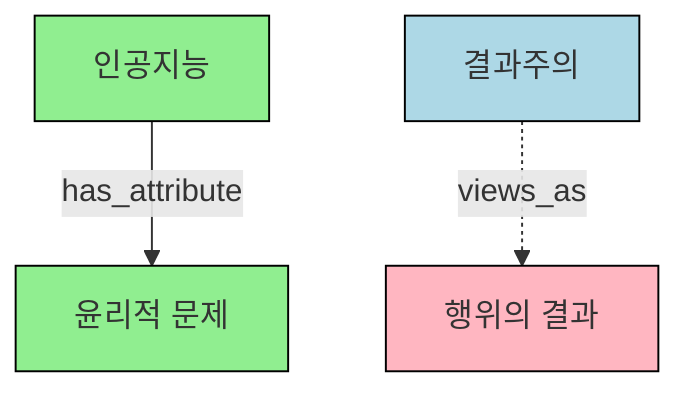

# KSAT Agent
_Multi-Agent 기반 수능 국어 독서 영역 출제 자동화 시스템_

```
제작자 : 권준희
소속 : 연세대학교 교육학과
ver 0.6.0 (05.07)
- 개념 지도 기반 passage_editor 전용 파인튜닝 모델 탑재
- 주제 선택 전문 에이전트 subject_collector 탑재
- Docker 이미지 생성 + Google Cloud Platform 서버 구축
```
<br>

<div align="center">
  <h3> 직접 사용해 보세요 ✨</h3>
  <a href="https://ksat-generator-kjh7207.streamlit.app/" target="_blank">
    
  </a>
  <p><i>버튼을 클릭하면 데모 앱 링크로 이동합니다. 🚀</i></p>
</div>
<br>

---

### 1️⃣ 개요

수능 국어, 특히 독서 지문의 출제에는 상당한 시간과 비용이 필요합니다.

KSAT Agent는 고품질의 수능 국어 독서 지문 세트를 **약 10분 안에** 완성하여 제공할 수 있습니다.

사용자는 AI와 함께 원하는 주제를 섬세하게 결정한 후, 나머지 출제 과정은 AI 에이전트들이 분담하여 처리합니다.

---

### 2️⃣ 효과성

기존 출제 프로세스를 크게 단축하고, 상당한 비용을 절감할 수 있습니다.

##### 기존 출제 프로세스

| 기존 출제 과정 | 주요 문제점 |
|----------------|------------|
| **출제 기간** | 초안 작성 → 검토 → 수정이 반복되어 1~2개월의 시간을 필요로 합니다. |
| **높은 출제 비용** | 지문 세트당 백만 원 이상의 높은 원고료를 지불해야 합니다. |
| **서면 위주 의사소통** | 출제자와 검토자가 분리되어 있는 구조로 인해, 의견 교환에 제한이 있고 즉각적인 피드백이 어렵습니다. |


##### KSAT Agent 활용 시

| 항목 | 기존 | KSAT Agent 사용 시 |
|------|---------|--------------------|
| **소요 시간** | 1 ~ 2 개월 | **10 분** |
| **비용** | 100~200만 원 | **500 원** (평균 사용량 기준) |
| **의사소통** | 서면 피드백 반복 | 기출 분석과 최신 경향을 학습한 AI와 **실시간 대화** |

---

### 3️⃣ 에이전트 구조

#### 핵심 아이디어

1. **역할 분담** – '주제선정·탐색·설계·집필·출제·검증·총괄' 각 단계를 전문화된 AI가 전담합니다.
2. **순환 검토** – 검증 단계에서 오류를 발견하면 이전 단계로 피드백하여 전체 일정을 단축합니다.
3. **대화형 인터페이스** – 사용자는 채팅 한 줄로 주제를 입력하고, 진행 상황과 결과를 실시간으로 확인합니다.


#### 에이전트 역할 요약

| 단계 | 에이전트 그룹 | 주요 업무 |
|------|----------|-----------|
| 사용자 입력 | **사용자** | 초기 주제 및 요구사항 전달 |
| 총괄 및 주제 구체화 | **Supervisor & Subject Collector** | 전체 절차 지휘, 사용자 의도 파악 및 상세 주제/서술 구조 확정 |
| 연구 및 설계 | **Researcher & Architecture** | 기출 지문 검색/분석, 개념 지도 초안 작성, 문단 배치 및 논리 흐름 설계, 문항 아이디어 구상 |
| 집필 및 출제 | **Passage Editor & Question Editor** | 설계안 기반 지문 집필, 5지선다 문항 및 해설 초안 작성 |
| 검증 | **Validator** | 지문/문항의 일관성, 논리 오류, 난이도 등 종합 검토 및 피드백/최종 승인 |
| 최종 결과물 | **시스템** | 완성된 지문, 문항, 해설 세트 |

*Validator가 "통과" 판정을 내리면 작업이 종료됩니다. Validator의 피드백에 따라 Supervisor는 이전 단계의 에이전트에게 재작업을 지시할 수 있습니다.


#### 작업 흐름



---

### 4️⃣ 세부 기술 구현

#### 프로젝트 구조

```
KSAT Agent/
├── frontend/               # Streamlit 기반 웹 인터페이스 (Git 관리, Streamlit Cloud 배포)
│   ├── pages/
│   │   └── about.py        # 프로젝트 소개 페이지
│   ├── app_main.py         # 메인 앱 진입점
│   ├── requirements.txt    # Frontend 의존성 (Streamlit Cloud용)
│   └── .streamlit/         # Streamlit 설정 (필요시)
│
├── backend/                # 멀티 에이전트 시스템 코어 (Git 관리)
│   ├── DB/                 # 데이터베이스 (ChromaDB, SQLite)
│   ├── agent_server.py     # FastAPI 서버 진입점
│   ├── graph_factory.py    # LangGraph 워크플로우
│   ├── agents_prompt/      # 에이전트별 프롬프트
│   ├── tools.py            # 에이전트 공용 도구
│   ├── handoff_tools.py    # 에이전트 핸드오프 도구
│   ├── model_config.py     # LLM 모델 설정
│   ├── Dockerfile          # Backend Docker 이미지 빌드용
│   ├── docker-compose.yaml # Docker Compose 설정
│   ├── supervisord.conf    # Supervisor 설정
│   └── requirements.txt    # Backend 의존성
│  
└── Parser/                 # (참고: 기출 문제 분석 및 데이터 전처리 로직 - Git 관리 범위 외)

```

#### 주요 기술 스택

| 영역 | 기술 | 용도 |
|------|------|------|
| **프론트엔드** | Streamlit | 사용자 인터페이스 및 실시간 진행상황 표시 |
| **백엔드** | FastAPI | API 서버 및 스트리밍 응답 처리 |
| **멀티에이전트** | LangGraph | 에이전트 간 상태 관리 및 워크플로우 |
| | LangChain | 메모리, 체인, 도구 활용 |
| **데이터베이스** | ChromaDB | 의미 검색 및 벡터 저장소 |
| | SQLite | 세션 상태 관리 및 체크포인트 |
| **LLM** | OpenAI GPT-4.1 | Supervisor 에이전트 |
| | Anthropic Claude-3.7 | Passage Editor 에이전트 |
| | Gemini-2.5 Flash | Researcher, Question Editor, Validator, Subject Collector 에이전트 |
| **임베딩** | OpenAI text-embedding-3 | 한국어 텍스트 벡터화 |
| **배포** | Docker, GCP (Google Cloud Platform) | Backend 서버 컨테이너화 및 클라우드 VM 배포 |
| | Streamlit Cloud | Frontend 웹 애플리케이션 배포 |
| **CI/CD** | GitHub Actions | 코드 변경 시 자동 빌드 및 배포 |

#### LangGraph 선택 배경

수능 지문 생성은 여러 단계의 복잡한 작업이 순차적으로 이루어져야 합니다. 초기에는 단일 LLM을 사용한 접근법도 고려했으나, 다음과 같은 한계에 직면했습니다:
```
1. 토큰 제한에 빠르게 도달 - 수능 지문 생성에 필요한 모든 지시와 컨텍스트가 16K 토큰을 쉽게 초과
2. 역할 혼란 - 하나의 모델이 연구자, 작가, 검토자 역할을 번갈아 수행하며 일관성 상실
3. 전문성 결여 - 전체 태스크를 한 번에 처리하려다 보니 각 단계별 품질이 저하
```
LangGraph는 이러한 문제들을 해결할 수 있는 최적의 프레임워크였습니다:

> **State 관리의 효율성** : LangChain의 단순 체인과 달리, LangGraph는 복잡한 상태를 그래프 노드 간에 유지하고 전달할 수 있어 여러 에이전트가 협업하기에 이상적입니다.
>
> **유연한 워크플로우** : 조건부 경로와 순환 가능한 그래프 구조를 통해 "검증 실패 → 재작업" 같은 복잡한 워크플로우를 자연스럽게 구현할 수 있습니다.
>
> **체크포인팅** : 내장된 체크포인트 기능을 활용하여, 장시간 실행 과정에서 발생할 수 있는 오류나 중단으로부터 상대적으로 안전하게 작업을 이어갈 수 있습니다. (본 프로젝트에서는 AsyncSqliteSaver를 사용)

```python
# graph_factory.py 중 일부
builder = StateGraph(MultiAgentState)

builder.add_node("subject_collector", subject_collector_agent) # 주제 구체화
builder.add_node("researcher", researcher_agent)
builder.add_node("architecture", architecture_agent)
# ... (다른 에이전트 노드 추가) ...
builder.add_node("validator", validator_agent)

builder.add_conditional_edges( # 검증 결과에 따른 분기
    "validator",
    lambda state: "architecture" if state.get("validation_result") == "rewrite_architecture" else
                 "passage_editor" if state.get("validation_result") == "rewrite_passage" else
                 "question_editor" if state.get("validation_result") == "rewrite_question" else
                 "END", # 최종 통과
    {"architecture": "architecture", "passage_editor": "passage_editor", "question_editor": "question_editor", "END": END}
)
graph = builder.compile(checkpointer=saver) # AsyncSqliteSaver 인스턴스 주입
```

#### LLM 모델 선택

각 태스크의 특성에 맞게 최적화된 LLM 모델을 사용했습니다.

실제 테스트 결과, Claude는 문체와 깊이 있는 내용 생성에 강점을 보였고, Gemini는 분석과 문항 생성의 속도에서 우위를 보였습니다.

이러한 모델 조합을 통해 품질과 비용 효율성 모두를 확보할 수 있었습니다.

| 에이전트 | 사용 모델 | 선택 이유 |
|---------|---------|----------|
| **Supervisor** | ```GPT-4.1``` | • 지시사항을 정확히 이해하고 따르는 능력(instruction following)이 탁월함<br>• 사용자 친화적인 어조로 소통하며 작업 흐름을 조율<br>• 복잡한 작업 흐름을 관리하는 능력이 뛰어남 |
| **Passage Editor** | ```Claude-3.7``` (파인튜닝 적용) | • 한국어 문체가 자연스럽고 수능 지문 스타일의 고품질 텍스트 생성<br>• 복잡한 개념도 논리적 구조를 유지하며 1,700자 내외로 압축하는 능력 탁월<br>• 내적 일관성이 높은 지문 작성 가능 |
| **Subject Collector, Researcher, Question Editor & Validator** | ```Gemini-2.5 Flash``` | • 빠른 응답 속도로 사용자 의도 파악, 지문 분석 및 문항 생성<br>• 수학적/논리적 관계 파악에 강점, 선지 간 변별력 체크에 효과적<br>• 비용 효율적이라 반복적 검증 및 다양한 탐색 과정에 적합 |

```python
# 예시: Passage Editor 에이전트 생성 (파인튜닝 모델 사용)
passage_editor_agent = create_react_agent(
    model="ft:gpt-4.1-ksat-agent-passage-editor-v2", # 파인튜닝된 모델 ID
    tools=passage_editor_tools,
    prompt=passage_prompt
)
```

#### 에이전트 간 작업 통제권 전환 메커니즘

초기 버전에서는 에이전트 간 전환을 위해 LangGraph의 조건부 엣지를 이용했습니다. 그러나 이는 다음과 같은 문제를 야기했습니다:

```
1. 확장성 한계 - 새 에이전트 추가 시, 분기 로직과 코드를 일일이 수정해야 함
2. 복잡한 상태 관리 - 누가 다음에 실행될지 추적하는 로직이 복잡해짐
3. 유연성 부족 - 실행 중 워크플로우 변경이 어려움
```

이를 해결하기 위해 Supervisor 에이전트가 다음 작업자를 명시적으로 호출하고, 호출된 에이전트는 자신의 역할을 수행 후 Supervisor에게 다시 제어권을 넘기는 방식을 채택했습니다. `handoff_to_supervisor` 도구를 사용하여 이 과정을 구현했습니다.

```python
# handoff_tools.py 일부
@tool
async def handoff_to_supervisor(
    # ... (매개변수 생략)
):
    """작업 완료 후 Supervisor에게 통제권을 넘깁니다."""
    # ... (메시지 생성 및 상태 업데이트 로직)
    return Command(goto="supervisor", ...) # Supervisor 노드로 이동
```

이 접근법의 장점은 Supervisor의 프롬프트와 판단 로직을 통해 워크플로우를 유연하게 관리할 수 있다는 점입니다.

#### ChromaDB 선택 이유와 임베딩 전략

LLM이 기출 문제를 능동적으로 검색할 수 있는 시스템을 구축하기 위해 여러 벡터 데이터베이스 옵션을 검토했습니다:

> 검토한 벡터 DB 후보:
> - Pinecone: 관리형 서비스, 확장성 우수
> - Milvus: 고성능 분산 처리 가능
> - ChromaDB: 경량화, 로컬 실행 가능, Python 통합 우수


최종적으로 ChromaDB를 선택한 이유는 다음과 같습니다:

1. **로컬 클라이언트**: 서버리스 환경에서도 SQLite 백엔드로 완전히 작동하여 외부 의존성 최소화. VM 환경에서 별도의 DB 서버 없이 파일 기반으로 운영 가능.
2. **메타데이터 필터링**: 연도, 월, 영역 등의 복합 필터링을 `where` 절로 간단히 구현 가능.
3. **임베딩 유연성**: 다양한 임베딩 모델을 쉽게 교체할 수 있는 아키텍처 지원.

한국어 텍스트 임베딩을 위해 여러 모델을 벤치마크한 결과, OpenAI의 `text-embedding-3-large`가 한글 수능 지문의 의미적 유사성을 가장 정확히 포착하는 것으로 확인되어 채택했습니다.

```python
# tools.py의 ChromaDB 검색 함수 예시
results = collection.query(
    query_texts=[query],
    n_results=n_results,
    where={"year": year, "field": field} # 메타데이터 필터링
)
```

#### 토큰 비용 관리

AI 모델의 컨텍스트 제한과 비용 문제를 해결하기 위해, 일반적으로 사용되는 요약 모델 접근법 대신 독창적인 "절삭+주입" 전략을 개발했습니다:

```python
# message_reducer.py의 메시지 절삭 로직 (개념)
# 실제 구현은 state['messages']를 직접 수정하거나, 훅(hook)을 통해 처리
def truncate_messages_for_llm(messages: list, max_tokens: int) -> list:
    """긴 메시지 목록을 LLM 입력 크기에 맞게 절삭합니다."""
    # ... (토큰 수 계산 및 절삭 로직)
    # 예: 최근 메시지 위주 보존, 시스템 메시지 보존, 중간 메시지 요약 또는 생략
    # 현재 프로젝트에서는 앞/뒤 일부만 남기는 방식을 사용함
    # if num_tokens(content) > TRUNCATE_THRESHOLD:
    #     truncated = content[:500] + "\n...[중략]...\n" + content[-500:]
    return processed_messages
```

이 접근법을 통해 얻은 이점:

1. **요약 모델 비용 절감**: 추가 LLM 호출 없이 단순 절삭으로 토큰 절약.
2. **중요 정보 보존**: 일반적으로 메시지의 앞부분(지시사항)과 뒷부분(최근 대화)에 중요 정보가 집중되어 있으므로, 이 부분을 유지.
3. **처리 지연 최소화**: 요약 모델 호출 대비 시간 절약.

실제 테스트에서 품질 저하 없이 토큰 사용량을 효과적으로 관리할 수 있었습니다.

---

### 5️⃣ 개념 지도

>개념 지도에 대한 상세한 설명은 부록을 참고 부탁드립니다.

#### 개념 지도 소개

교육 콘텐츠 평가에서 "논리 구조가 복잡하다"나 "정보 밀도가 높다"와 같은 표현은 주관적이고 정성적인 평가에 불과했습니다. 이로 인해 난이도와 정보 밀도의 조절이 출제자의 경험과 직관에 의존해야 했고, AI를 활용한 자동화 시스템 구축이 어려웠습니다.

KSAT Agent는 자체 개발한 **개념 지도**를 통해 이러한 정성적 평가를 정량화했습니다:

| 기능 | 기존 방식 | 개념 지도의 효과 |
|------|-----------|--------------------------------|
| 논리 구조 파악 | 전문가의 주관적 평가 | **엣지 타입·깊이**를 계량화 |
| 정보 밀도 판단 | 단순 글자수·문단수 | **노드 수 / 1천 token** 지표 |
| 선지 생성 근거 | 수작업 검색 | 그래프 경로 탐색 |

##### ① 예시 지문

> "촉매는 화학 반응의 활성화 에너지를 낮춰 반응 속도를 높입니다. 그러나 촉매 자체는 반응 전후에 변하지 않습니다."

##### ② 자동 추출된 그래프

| 노드 ID | 라벨 | 설명 |
|---------|------|------|
| N1 | Catalyst | 촉매 |
| N2 | ActivationEnergy | 활성화 에너지 |
| N3 | ReactionRate | 반응 속도 |

| 엣지 | 타입·레이블 | 의미 |
|------|-------------|------|
| N1→N2 | Causality · `influences` | 촉매가 에너지를 낮춤 |
| N2→N3 | Causality · `causes` | 낮아진 에너지가 속도 증가 초래 |
| N1→N1 | QuantComparison · `is_equal_to` | 촉매 전후 동일(자기 보존) |

이러한 정량적 지표를 통해 Question Editor는 "원인→결과→불변" 경로를 선지 패턴으로 활용할 수 있습니다.

이처럼 개념 지도는 논리 구조, 정보 밀도, 추론 경로를 객관적 수치로 변환하여, 개념 지도의 적용을 통해 에이전트에게 지문의 난이도와 정보 밀도를 정량적으로 주문할 수 있게 됩니다.

 

---

### 6️⃣ 지문 작성용 LLM 파인튜닝

**Problem** 
> "본질적으로 '쉽고 직관적으로' 설명하도록 학습된 LLM 모델의 특성 상,<br>
> 프롬프트만으로 정보의 밀도와 독해 난이도를 극적으로 향상시키기에는 한계가 있다고 느꼈다."

따라서 다음의 데이터 파이프라인을 구축하여 소규모 파인튜닝을 진행한 결과, 지문 퀄리티를 극적으로 향상시킬 수 있었다. (이 과정은 `Parser/` 및 별도 스크립트를 통해 진행)

| 구분 | 내용 |
|------|------|
| 학습 데이터 1 | LLM을 활용해 **기출 지문**에서 추출한 개념 지도 |
| 학습 데이터 2 | 기출 지문 원문 |

#### ① SFT 데이터셋 생성 파이프라인

| 단계               | 스크립트 (`Parser/` 및 관련 스크립트)        | 핵심 로직·함수                                                   | 산출물                                     |
| ---------------- | --------------------------------- | ---------------------------------------------------------- | --------------------------------------- |
| **1. 기출 txt 파싱** | `concept_map_converter.py` (가칭)   | `passage_parser()` 〈줄바꿈·특수 기호 정리〉                          | `passage` (*str*)                       |
| **2. 개념 지도 변환**  | `convert_concept_map_async()` (가칭) | Gemini-2.5-flash -> JSON (15 ± 5 노드)                       | `concept_map.json`                      |
| **3. JSONL 빌드**  | `training_data_generator_async()` (가칭) | 3-turn 메시지 샘플<br>`system→user(concept)→assistant(passage)` | `…training_dataset.jsonl`               |
| **4. 검증·Split**  | `data_validation_cli.py` (가칭)     | 토큰·포맷 검사 → 90 / 10 split                                   | `train.jsonl` (76) <br>`val.jsonl` (10) |

> *데이터 통계* : 전체 ≈ 12 만 tokens, 1 샘플 평균 1 500 tokens

---

#### ② Fine-Tune 설정 (OpenAI)


| 파라미터       | 값                                           | 비고             |
| ---------- | ------------------------------------------- | -------------- |
| Base model | `gpt-4.1-2025-04-14`                        | 2025-Q2 공개     |
| Epochs     | 3 (*auto*)                                  | 데이터 소량, 과적합 방지 |
| Batch / LR | auto / default                              |                |
| Run ID     | `ft:gpt-4.1-…:ksat-agent-passage-editor-v2` |                |

**결과 지표**

| Metric          | 값         |
| --------------- | --------- |
| Train loss      | **0.274** |
| Valid loss      | **0.255** |
| Full valid loss | 0.302     |

(loss gap ≈ 0.02 → 안정 수렴)

---

#### ③ Inference 파라미터 (안정 preset)

```python
gen_cfg = {
    "model": "ft:gpt-4.1-ksat-agent-passage-editor-v2",
    "temperature": 0.30,
    "top_p": 0.85,
    "repetition_penalty": 1.2,
    "max_tokens": 1200,
}
```

* `temperature 0.5` : 논리 일관성↑
* `top_p 0.85`      : 기본값에 비해 보수적으로 책정하여 문체 일관성↑
* `repetition_penalty 1.2` : 꼬리 반복 현상상 90 %↓

---

#### ④ 정량적 개선 결과

| 지표                 | 프롬프트 Only | Fine-Tune 후 | 개선폭    |
| ------------------ | --------- | ----------- | ------ |
| 단락별 "정의→인과→비교" 완성률 | 38 %      | **71 %**    | +33 %p |
| 매력적 오답(값·조건 교란) 비율 | 42 %      | **88 %**    | +46 %p |
| 중복·불필요 문장 비중       | 12 %      | **3 %**     | -9 %p  |
| 수능 전문가 총점(5점 만점)   | 3.0       | **4.5**     | +1.5   |

---

#### ⑤ 주요 이슈 & 해결책

| 이슈                                 | 해결 방법                                  |
| ---------------------------------- | -------------------------------------- |
| 동일 문장, 문단 반복                       | `repetition_penalty=1.2` + Top-k 노드 필터 |
| 이상한 문자열이 출력되는 현상                      | `temperature=0.6` 하향 조정 |

---

### 7️⃣ 서버 아키텍처

#### 7.1 다중 사용자 세션 관리

다중 사용자 환경에서 각 사용자의 작업 상태를 안전하게 관리하기 위해 세 가지 핵심 요소를 도입했습니다:

| 요소 | 사용 기술 | 주요 기능 |
|------|-----------|----------|
| **대화 상태** | `MultiAgentState` (`TypedDict`) | 에이전트 간 메시지·요약·검색 결과를 단일 객체로 공유 |
| **세션 DB** | `AsyncSqliteSaver` | Stream lit 다중 사용자 환경에서 세션별 체크포인트 유지 |
| **만료 정리** | `cleanup_old_sessions()` | 24 시간 후 SQLite 파일 자동 삭제로 디스크 사용 최소화 |

이를 통해 여러 사용자가 동시에 시스템을 사용해도 각 작업이 완전히 분리되어 관리되며, 

만약 작업 중 오류가 발생하더라도 서버 DB에 저장된 세션을 불러와 마지막 체크포인트부터 작업을 재개할 수 있습니다:

```python
# 각 사용자별 독립된 세션 데이터베이스 생성
memory = await aiosqlite.connect(f"sessions/{user_id}_{timestamp}.db")
saver  = AsyncSqliteSaver(memory)
await saver.setup()          # 필요한 테이블 자동 생성

# 중요 작업 단계마다 상태 스냅샷 저장
await saver.flush(state)     # 체크포인트 생성
```


#### 7.2 실시간 스트리밍 구현

작업 시간이 5-10분 정도 소요되는 시스템에서는 사용자에게 진행 상황을 실시간으로 보여주는 것이 중요합니다. 

이를 위해 FastAPI의 스트리밍 기능과 LangGraph의 `astream` 기능을 결합했습니다:

```python
@app.post("/chat/stream")
async def chat_stream_endpoint(request: ChatRequest):
    """실시간으로 에이전트 작업 과정을 스트리밍합니다"""
    async def event_generator():
        # 각 에이전트의 작업 과정을 실시간으로 스트림으로 전송
        async for item in stream_agent_response(request):
            # 줄바꿈을 추가해 클라이언트가 각 이벤트를 구분할 수 있게 함
            yield item + "\n"
    
    # 브라우저에 지속적인 연결 유지를 위한 헤더 설정
    return StreamingResponse(
        event_generator(),
        media_type="application/json",
        headers={
            "Cache-Control": "no-cache",  # 캐싱 방지
            "Connection": "keep-alive",   # 연결 유지
        }
    )
```

이 구현을 통해 사용자는 실시간 진행 상황을 토큰 단위로 확인할 수 있습니다.

서버-클라이언트 간 데이터 전송을 위해 SSE(Server-Sent Events) 대신 단순 JSON 라인 형식을 채택하여 토큰 단위 전송-파싱 과정을 단순화했습니다.

#### 7.3 운영 환경

KSAT Agent 백엔드 시스템은 안정적이고 확장 가능한 운영을 위해 다음과 같은 환경으로 구성되어 있습니다.

*   **실행 환경**: 애플리케이션은 Docker 컨테이너로 패키징되어, GCP (Google Cloud Platform) Compute Engine VM 인스턴스에서 실행됩니다. 이를 통해 개발 환경과 운영 환경의 일관성을 유지하고 배포를 용이하게 합니다.

*   **프로세스 관리**: 컨테이너 내부에서는 Supervisor가 메인 애플리케이션 서버 프로세스(Uvicorn 기반 FastAPI 서버)를 관리합니다. Supervisor는 애플리케이션의 예상치 못한 종료 시 자동으로 재시작하여 서비스의 안정성을 높이며, 로그 관리 기능을 제공합니다.

*   **지속적 통합 및 배포 (CI/CD)**: GitHub Actions를 활용하여 CI/CD 파이프라인을 구축했습니다. GitHub 저장소의 `main` 브랜치에 코드가 푸시되면, GitHub Actions가 자동으로 VM 서버에 접속하여 최신 코드를 가져오고, Docker 이미지를 재빌드한 후 컨테이너를 재시작합니다. 이 자동화된 프로세스는 신속하고 일관된 배포를 보장합니다.

*   **인프라 구성**:
    *   **Dockerfile (`backend/`)**: 백엔드 애플리케이션 실행에 필요한 모든 종속성(Python 버전, 라이브러리 등)과 환경 설정을 정의합니다.
    *   **docker-compose.yaml (`backend/`)**: Docker 컨테이너의 빌드 방식, 포트 매핑, 볼륨 설정, 재시작 정책 등을 정의하여 애플리케이션 실행을 관리합니다.
    *   **supervisord.conf (`backend/`)**: Supervisor가 관리할 프로세스의 실행 명령어, 자동 시작/재시작 정책, 로그 경로 등을 설정합니다.
    *   **requirements.txt (`frontend/`, `backend/`)**: 각 애플리케이션의 Python 의존성을 명시합니다.
    *   **.env (`backend/`)**: API 키와 같은 민감한 환경 변수를 관리합니다. 이 파일은 Git 저장소에 포함되지 않으며, 서버에 직접 설정됩니다.

---
### 8️⃣ 맺음말

KSAT Agent는 기존 출제 프로세스를 상당 부분 효율화할 수 있을 것으로 기대합니다. 투입 비용을 낮춤으로써, 양질의 문항이 저렴한 가격에 공급될 수 있기를 바랍니다. 

KSAT Agent가 교사와 학생들에게 실질적인 이로움을 가져다 주고, 나아가 교육 콘텐츠 제작의 패러다임을 바꾸는 계기가 되면 좋겠습니다. 

감사합니다.


<br>
<br>

### :bulb: 부록 : # 개념 지도 스키마 v6.0 매뉴얼
*수능 독서 고난도 지문 설계를 위한 통합 프레임워크*

## 1. 개요 및 필요성

개념 지도 v6.0은 수능 독서 지문의 **내용적 구조**와 **서술적 구조**를 통합적으로 설계하기 위한 프레임워크입니다. v5.0이 개념 간 관계 구조에 초점을 맞추었다면, v6.0은 여기에 내러티브 흐름과 텐션을 결합하여 더욱 정교한 지문 설계를 가능하게 합니다.

### 필요성

1. **평면적 지문 극복**: 단순히 개념들을 나열하는 평면적 서술에서 벗어나 입체적이고 유기적인 지문 설계 가능
2. **변별력 강화**: 상위권 학생들을 변별할 수 있는 텐션 구조와 암시적 논리 관계 설계 
3. **통합적 접근**: 지문의 "무엇을"(개념)과 "어떻게"(서술 방식)를 동시에 설계하는 체계 제공
4. **문항 설계 연계**: 다양한 난이도와 유형의 문항을 효과적으로 설계할 수 있는 기초 제공

## 2. v5.0에서 v6.0으로의 주요 변경점

| 구분 | v5.0 | v6.0 |
|------|------|------|
| **구조** | 단일 계층 구조 (개념 노드-엣지) | **이중 계층 구조** (문단 노드-엣지 + 개념 노드-엣지) |
| **내러티브** | 미지원 | **내러티브 패턴, 텐션 곡선** 지원 |
| **개념 엣지** | 엣지 타입-레이블 체계 | 기존 체계 + **명시적/암시적 구분, 난이도 분류** |
| **시각화** | 개념 그래프 | 개념 그래프 + **문단 흐름도, 텐션 곡선** |
| **문단 구조** | 미지원 | **문단 역할, 텐션 수치** 지원 |
| **표준 형식** | JSON | JSON (확장형) |

## 3. 이중 계층 구조

v6.0의 핵심은 **이중 계층 구조**로, 지문을 거시적(문단 레벨)과 미시적(개념 레벨) 관점에서 동시에 설계할 수 있습니다.

```
[지문]
  ├── [문단1] --- [문단2] --- [문단3] --- [문단4]  # 문단 노드-엣지 (거시적 구조)
  │     │           │           │           │
  │     ▼           ▼           ▼           ▼
  │  [개념A]      [개념D]      [개념G]      [개념J]  
  │     │           │           │           │
  │  [개념B] --- [개념E] --- [개념H] --- [개념K]  # 개념 노드-엣지 (미시적 구조)
  │     │           │           │           │
  │  [개념C]      [개념F]      [개념I]      [개념L]
```

이 구조는 다음과 같은 이점을 제공합니다:
- 문단 간 논리적 흐름과 개념 간 관계를 분리하여 설계
- 문단 내 개념 밀도와 텐션을 통제하여 난이도 조절
- 전체 지문의 내러티브 구조와 텐션 곡선 설계

## 4. 문단 노드 속성 및 구조

문단 노드는 지문의 거시적 구조를 구성하는 기본 단위로, 다음과 같은 속성을 가집니다:

```json
{
  "id": "p1",                  // 문단 식별자
  "order": 1,                  // 문단 순서
  "role": "intro",             // 문단 역할
  "tension_level": 2,          // 텐션 수치 (1-5)
  "description": "개념 소개",   // 문단 내용 요약
  "contains_nodes": ["n1", "n2", "n3"],  // 포함된 개념 노드 ID
  "primary_concept": "n1"      // 핵심 개념 노드 ID
}
```

### 문단 역할 유형

| 역할 | 설명 | 주요 기능 |
|------|------|----------|
| **intro** | 도입 | 주제 소개, 배경 설명, 문제 제기 |
| **define** | 정의 | 핵심 개념 정의, 용어 설명 |
| **explain** | 설명 | 원리 분석, 관계 설명, 메커니즘 해설 |
| **contrast** | 대조 | 상반된 관점 비교, 차이점 분석 |
| **exemplify** | 예시 | 구체적 사례 제시, 적용 예 소개 |
| **extend** | 확장 | 개념 심화, 추가 논점 소개 |
| **challenge** | 도전 | 한계 지적, 반론 제시, 문제 제기 |
| **synthesize** | 종합 | 논점 통합, 결론 도출 |
| **conclude** | 결론 | 요약, 의의 및 시사점 제시 |

## 5. 문단 엣지 유형

문단 엣지는 문단 간의 논리적 연결을 나타냅니다:

```json
{
  "source_id": "p1",
  "target_id": "p2",
  "type": "builds_upon"
}
```

### 문단 엣지 유형

| 유형 | 설명 | 예시 연결 |
|------|------|----------|
| **builds_upon** | 앞 문단의 내용 발전/심화 | 정의 → 상세 설명 |
| **contrasts_with** | 대조적 관점/현상 제시 | A이론 → B이론 |
| **introduces_problem** | 문제 제기 | 현상 → 문제점 |
| **provides_solution** | 해결책 제시 | 문제점 → 해결방안 |
| **exemplifies** | 구체적 사례/적용 제시 | 이론 → 사례 |
| **shifts_perspective** | 관점 전환 | 기술적 → 윤리적 |
| **specifies_condition** | 조건/한계 명시 | 일반론 → 예외/조건 |
| **concludes_from** | 앞 내용에서 결론 도출 | 논증 → 결론 |

## 6. 개념 노드 및 엣지 유형

개념 노드와 엣지는 v5.0의 체계를 유지하며, 다음과 같은 속성을 가집니다:

```json
// 개념 노드
{
  "id": "n1",
  "label": "개념명",
  "type": "concept",
  "tier": "core",           // core/support
  "paragraph_id": "p1",     // 소속 문단 ID (v6.0 추가)
  "discourse_role": "claim" // 담론 역할
}

// 개념 엣지
{
  "source_id": "n1",
  "target_id": "n2",
  "type": "Causality",
  "label": "causes",
  "explicitness": "explicit",  // explicit/implicit (v6.0 추가)
  "complexity": "medium",      // low/medium/high (v6.0 추가)
  "supporting_sentence": "..."
}
```

## 7. 암시적/명시적 엣지 구분

v6.0에서는 개념 엣지를 **명시적(explicit)**과 **암시적(implicit)**으로 구분합니다:

- **명시적 엣지**: 텍스트에 직접 언급된 관계 (예: "A는 B를 유발한다")
- **암시적 엣지**: 텍스트에 직접 언급되지 않았으나 추론 가능한 관계

```json
// 명시적 엣지
{
  "source_id": "n1",
  "target_id": "n2",
  "type": "Causality",
  "label": "causes",
  "explicitness": "explicit",
  "supporting_sentence": "A는 B를 유발한다."
}

// 암시적 엣지
{
  "source_id": "n3",
  "target_id": "n4",
  "type": "Evaluation",
  "label": "views_as",
  "explicitness": "implicit",
  "inference_basis": ["p2-s3", "p3-s1"]  // 추론의 근거가 되는 문장
}
```

### 암시적 엣지의 중요성

암시적 엣지는 상위권 학생들을 변별하는 핵심 요소로, 다음과 같은 기능을 합니다:

1. **추론 역량 측정**: 명시되지 않은 논리적 연결을 파악하는 능력 요구
2. **문항 소재 제공**: 추론형, 적용형 문항의 핵심 소재로 활용
3. **실제 학술 텍스트 반영**: 실제 전문적 텍스트의 논리적 특성 반영

## 8. 텐션 수치 설계 및 영향

텐션 수치는 문단 단위의 정보 밀도와 추론 부담 수준을 1-5 척도로 정량화한 값입니다:

### 텐션 수치별 특성

| 텐션 수치 | 문단 특성 | 개념 노드/엣지 영향 |
|---------|---------|-------------------|
| **1** (낮음) | • 기본 개념 소개<br>• 배경 설명<br>• 친절한 서술 | • 소수의 핵심 노드(2-3개)<br>• 단순한 엣지 유형<br>• 암시적 엣지 없음 |
| **2** (기본) | • 개념 확장<br>• 맥락 제공<br>• 구체적 예시 | • 중간 수준 노드(3-5개)<br>• 일반적 엣지 유형<br>• 암시적 엣지 20% 미만 |
| **3** (중간) | • 개념 응용<br>• 일부 추론 요구<br>• 복합 개념 도입 | • 다양한 노드(5-7개)<br>• 다양한 엣지 유형<br>• 암시적 엣지 30% |
| **4** (높음) | • 다중 관점 제시<br>• 대조적 내용<br>• 추상화 수준 높음 | • 복잡한 노드 구조(7-9개)<br>• 고급 엣지 유형<br>• 암시적 엣지 50% |
| **5** (매우 높음) | • 통합적 재구성<br>• 심층적 함의<br>• 높은 추론 요구 | • 긴밀히 연결된 다수 노드(8-10개+)<br>• 복합 엣지 패턴<br>• 암시적 엣지 70% |

### 텐션 곡선 패턴

전체 지문의 텐션 분포를 설계하는 패턴:

| 패턴 | 텐션 분포 | 효과 |
|------|---------|------|
| **점진적 상승** | [1→2→3→4→5] | 점층적 이해 요구, 고난도 결론 |
| **클라이맥스형** | [2→3→5→4→2] | 핵심 난제 후 해소 |
| **교차형** | [2→4→2→5→3] | 긴장-이완 교차로 독해 피로 방지 |
| **단계형** | [2→2→4→4→5] | 난이도 단계 뚜렷, 평탄구간 제공 |
| **심층부 집중** | [1→2→5→5→3] | 중심부에 핵심 정보 밀집 |

## 9. 개념 엣지 난이도 분류

v6.0에서는 개념 엣지를 난이도에 따라 분류합니다:

### 난이도별 엣지 유형

| 난이도 | 엣지 유형 | 특징 |
|-------|---------|------|
| **초급** | • Definition<br>• Classification<br>• Property<br>• Composition<br>• Example | • 직관적 이해 가능<br>• 단순한 논리 관계<br>• 명시적 표현이 대부분 |
| **중급** | • Causality<br>• Purpose<br>• Comparison<br>• Temporal<br>• Spatial<br>• Reference<br>• Conditional | • 2단계 추론 필요<br>• 영역 특수적 지식 활용<br>• 부분적 암시적 표현 |
| **고급** | • Argumentation<br>• CounterCausality<br>• Exception<br>• Modality<br>• Methodology<br>• Hierarchy<br>• Evaluation<br>• QuantComparison | • 다단계 추론 요구<br>• 전문적 사고 체계 필요<br>• 대부분 암시적 표현 |

## 10. 내러티브 패턴 템플릿

지문 전체의 내러티브 구조를 설계하기 위한 템플릿:

### 내러티브 패턴 유형

| 패턴 | 문단 구성 | 적합한 주제 |
|------|---------|-------------|
| **문제-해결** | 현상 소개→문제 제기→해결 과정→결론/의의 | 과학 기술, 사회 문제 |
| **대조-종합** | 개념 도입→관점A→관점B→비교/대조→종합/평가 | 철학, 인문학적 논쟁 |
| **시간적 전개** | 배경→발전 과정→현재→미래 전망 | 역사, 기술 발전사 |
| **논증 구조화** | 주장→근거→반론→재반박→결론 | 윤리, 법학, 사회 논쟁 |
| **개념 심화** | 기본 정의→세부 요소→작동 원리→한계/예외→응용 | 자연과학, 공학 |

## 11. JSON 스키마 예시

전체 지문의 개념 지도 v6.0 표현 예시:

```json
{
  "$schema": "https://kice-graph.org/schema/v6.0",
  "graph_id": "2026_06_section_8_11",
  "document_source": {
    "title": "인공지능의 윤리적 문제",
    "domain": "기술",
    "subdomain": "인공지능"
  },
  "narrative_pattern": "대조-종합",
  "tension_curve": [1, 3, 4, 5, 3],
  
  "paragraphs": [
    {
      "id": "p1",
      "order": 1,
      "role": "intro",
      "tension_level": 1,
      "description": "인공지능 윤리의 필요성 소개",
      "contains_nodes": ["n1", "n2", "n3"],
      "primary_concept": "n1"
    },
    {
      "id": "p2",
      "order": 2,
      "role": "explain",
      "tension_level": 3,
      "description": "결과주의적 관점의 AI 윤리",
      "contains_nodes": ["n4", "n5", "n6", "n7", "n8"],
      "primary_concept": "n4"
    },
    // 추가 문단...
  ],
  
  "paragraph_edges": [
    {
      "source_id": "p1",
      "target_id": "p2",
      "type": "builds_upon"
    },
    {
      "source_id": "p2",
      "target_id": "p3",
      "type": "contrasts_with"
    },
    // 추가 문단 엣지...
  ],
  
  "nodes": [
    {
      "id": "n1",
      "label": "인공지능",
      "type": "concept",
      "tier": "core",
      "paragraph_id": "p1",
      "discourse_role": "subject"
    },
    {
      "id": "n2",
      "label": "윤리적 문제",
      "type": "concept",
      "tier": "core",
      "paragraph_id": "p1",
      "discourse_role": "claim"
    },
    // 추가 노드...
  ],
  
  "edges": [
    {
      "source_id": "n1",
      "target_id": "n2",
      "type": "Property",
      "label": "has_attribute",
      "explicitness": "explicit",
      "complexity": "low",
      "supporting_sentence": "인공지능 기술의 발전은 새로운 윤리적 문제를 제기한다."
    },
    {
      "source_id": "n4",
      "target_id": "n6",
      "type": "Evaluation",
      "label": "views_as",
      "explicitness": "implicit",
      "complexity": "high",
      "inference_basis": ["p2-s3", "p2-s4"]
    },
    // 추가 엣지...
  ]
}
```

## 12. 머메이드 시각화 표준

v6.0 개념 지도는 다음 두 가지 다이어그램으로 시각화합니다:

### 1. 문단 흐름도 (거시적 구조)



### 2. 개념 구조도 (미시적 구조)



## 13. 품질 체크리스트

개념 지도 v6.0이 완성되면 다음 체크리스트로 품질을 검증합니다:

1. **완전성 검증**
   - [ ] 모든 주요 개념이 노드로 포함됨
   - [ ] 문단별 텐션 수치가 모두 정의됨
   - [ ] 암시적 엣지가 충분한 근거를 가짐

2. **일관성 검증**
   - [ ] 텐션 수치와 노드/엣지 분포가 일치함
   - [ ] 내러티브 패턴이 문단 역할과 일관됨
   - [ ] 개념 간 계층 구조가 논리적으로 일관됨

3. **변별력 검증**
   - [ ] 최소 30% 이상의 암시적 엣지 포함
   - [ ] 텐션 수치 4-5 문단이 1개 이상 포함
   - [ ] 고급 난이도 엣지가 25% 이상 포함

4. **출제 가능성 검증**
   - [ ] 세부 정보 파악, 추론, 적용 유형 문항 설계 가능
   - [ ] 개념 간 비교/대조를 요구하는 문항 설계 가능
   - [ ] 최소 1개 이상의 고난도 문항 설계 가능

## 부록: 엣지 타입 및 레이블 참조표

개념 엣지는 v5.0의 체계를 그대로 유지합니다:

| Type | Label | 설명 | 난이도 |
|------|-------|------|-------|
| **Hierarchy** | is_parent_of, is_child_of | 상하위 관계 | 고급 |
| **Classification** | belongs_to | 분류 관계 | 초급 |
| **Definition** | defines | 정의 관계 | 초급 |
| **Composition** | has_part | 부분-전체 관계 | 초급 |
| **Property** | has_attribute | 속성 관계 | 초급 |
| **Comparison** | is_similar_to, differs_from | 유사/대조 관계 | 중급 |
| **QuantComparison** | is_greater_than, is_less_than, is_equal_to, delta_is_positive, delta_is_negative | 수량 비교 | 고급 |
| **Causality** | causes, influences | 인과 관계 | 중급 |
| **CounterCausality** | mitigates, exacerbates | 역인과 관계 | 고급 |
| **Conditionality** | requires, depends_on | 조건 관계 | 중급 |
| **Exception** | has_exception, has_scope_limit | 예외/한계 | 고급 |
| **Temporal** | occurs_at, before, after | 시간 관계 | 중급 |
| **Spatial** | is_located_at | 공간 관계 | 중급 |
| **Purpose** | has_purpose, functions_as, uses_means | 목적 관계 | 중급 |
| **Example** | is_example_of | 예시 관계 | 초급 |
| **Reference** | refers_to, is_source_of | 참조 관계 | 중급 |
| **Evaluation** | views_as, has_stance | 평가 관계 | 고급 |
| **Argumentation** | supports, contradicts, rebuttal_of, argument_unit | 논증 관계 | 고급 |
| **Methodology** | uses_framework, is_derived_from | 방법론 관계 | 고급 |
| **Modality** | is_hypothetical, has_probability | 양태 관계 | 고급 |
